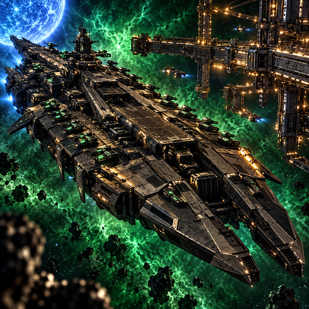

# Equipment Mod Sync for X4: Foundations

<p align="center">
  
</p>

On a large ship, putting the same equipment mod on every turret group means opening each slot and pressing Install, or Reroll, twenty or thirty times. This mod adds a checkbox to the Modify screen: tick it, install or reroll the mod on one slot, and every other compatible slot in that category gets the same treatment.

**Requires X4: Foundations 9.00.** No DLC required, and no hard dependency on other mods. Works on an existing savegame.

## Install

```bash
./install.sh
```

The helper copies `extension/` into the game's `extensions/<extension-id>` directory, using the id in `extension/content.xml`. It searches the usual Steam layouts and additional library folders. To choose an installation:

```bash
X4_PATH="/path/to/X4 Foundations" ./install.sh
```

Restart X4 after installing or updating. To remove the manual installation:

```bash
./install.sh --uninstall
```

Protected UI Mode can stay on. It does not stop extension Lua from loading; it only aborts a handful of online functions when they are called from code Egosoft did not sign, and this mod calls none of them.

## Using it

At a wharf, shipyard or equipment dock, open **Modify** on a ship and pick Weapons, Turrets or Shields. Above the slots is a checkbox, **Apply to all compatible slots in this category**. Engines and the ship mod have only one slot, so the checkbox is not shown for them.

With the checkbox ticked, Install or Reroll on any slot does the following:

- The clicked slot is done first, exactly as vanilla does it.
- Every other slot listed in the category follows, one after another, each going through vanilla's own path: it dismantles what is there, pays for it and installs.
- **Install** fills every slot, empty ones included. **Reroll** only touches slots that already hold a mod; empty slots are left empty.
- A slot whose weapon or shield cannot take that mod is skipped.
- A slot that holds the **same** mod is rerolled. A slot that holds a **different** mod is replaced by default, or skipped if **Replace a different mod** is off.
- The batch stops at the first slot you cannot pay for, either in crafting materials or in credits at a dock you do not own. The slots done by then stay done.
- **Bonus effects are matched.** A mod picks its bonus effects at random from a pool: `mod_weapon_damage_02_mk3`, for example, picks three of cooling, reload, stick time and rotation speed. So after the batch, every slot whose bonus effects differ from the clicked slot's is rerolled again until they match. These extra rerolls are **free**: the mod puts in the materials one reroll needs, rerolls without paying, and sets your inventory back to exactly what it was. You pay once per slot, as for the clicks you would have made by hand.

A line under the checkbox shows what the last batch did and what it cost, for example `Last batch: 6 applied, 0 skipped. Bonus effects: 5 matched, 0 not matched, 14 free rerolls. Paid 1,500,000 Cr; free rerolls cost 0 Cr`. With **Debug logging** on, the same line, with the materials each phase used, is also written to the debug log.

The checkbox starts ticked or unticked according to the option below, and a change made on the screen lasts until the screen closes.

### Values are still random

The game rolls a mod's values when it is installed, and nothing a mod can call sets them, so every slot gets its own roll. Bonus matching makes the *kind* of bonus effects identical, not their size. To have every slot come out identical, at the best value, pair it with any mod that collapses the ranges in `libraries/equipmentmods.xml` onto their maximum, such as [Max Equipment Mods](https://steamcommunity.com/sharedfiles/filedetails/?id=2753871485). The two do not touch each other: this one only presses Install or Reroll on each slot, and the game rolls from whatever ranges are loaded.

## Options

With [SirNukes Mod Support APIs](https://steamcommunity.com/sharedfiles/filedetails/?id=2042901274) installed: **Options → Extension Options → Equipment Mod Sync**.

| Option                      | Default | What it does                                                                                    |
|-----------------------------|---------|-------------------------------------------------------------------------------------------------|
| **Checkbox ticked on open** | off     | whether the checkbox starts ticked when the Modify screen opens                                 |
| **Replace a different mod** | on      | what applying to all does with a slot that holds a different mod: replace it, or leave it alone |
| **Match bonus effects**     | on      | reroll the other slots for free until their bonus effects match the clicked one                 |
| **Free rerolls per slot**   | 100     | 10 to 500; how many free rerolls a slot gets before it is left as it is                         |
| **Debug logging**           | off     | write every batch, with the credits and materials each phase used, to the debug log             |

Without the API the defaults apply.

## How it works

It is a UI mod: one Lua file, loaded through the extension's `ui.xml` the same way Egosoft's own DLCs load theirs, plus one MD file for the options. No vanilla file is replaced and nothing is patched. The Lua wraps four functions of the ship configuration menu and calls the originals through, so the vanilla screen, and any mod that replaces it such as kuertee's UI Extensions, keeps working underneath.

- **The clicks are vanilla's own.** Every paid slot goes through the same function the Install and Reroll buttons call: it dismantles what is there, takes the credits at a dock you do not own, and installs. Compatibility is decided by the same checks vanilla uses to list the blueprints for a slot.
- **The free rerolls are not.** They call the game's dismantle and install directly, which charges nothing, and the materials the engine consumes are put back: the mod snapshots the mod's material wares, adds whatever one reroll needs, rerolls, and sets the inventory back to the snapshot.
- **Matching** compares, slot by slot, the set of properties the installed mod changes, against the slot you clicked.

The game has no function that sets a mod's values, so the size of each roll stays the game's; see [Values are still random](#values-are-still-random).

## Debugging

Add this to the game's launch options — Steam, right click X4, **Properties → General → Launch Options**:

```
-debug all -logfile debuglog.txt
```

The log lands next to your savegames: `$HOME/.config/EgoSoft/X4/<userid>/debuglog.txt` on Linux, `Documents\Egosoft\X4\<userid>\debuglog.txt` on Windows. If Steam is installed as a snap it runs the game with a redirected home, which puts both under `~/snap/steam/common/`.

The mod is silent by default. Turn on **Debug logging** in the options and every batch writes one line, with what it did and the credits and materials each phase used:

```
drjele_equipment_mod_sync: mod_weapon_damage_02_mk3 | Last batch: 6 applied, 0 skipped. Bonus effects: 5 matched, 0 not matched, 19 free rerolls. Paid 1,500,000 Cr; free rerolls cost 0 Cr | paid phase: 1500000 Cr, materials modpart_highenergycatalyst -12 | free phase: 0 Cr, materials none
```

The line is written through `DebugError`, the only log call Lua has, so it shows up tagged `[=ERROR=]`; that is not an error. A Lua error in the mod itself is logged with the same prefix, and the batch it happened in is abandoned without touching the remaining slots.

## Removing it

Take it out at any time. Installed mods stay as they are. The option values the mod keeps on the player are left in the savegame and are never read again.

## Status

Verified in game on 9.00, with Protected UI Mode on, SirNukes Mod Support APIs and Max Equipment Mods enabled: on the six turret groups and eight shield groups of an L freighter, and on the main weapons and ungrouped turrets of two M ships, at player-owned and Alliance wharfs:

| Check                 | Result                                                                                                                                                                                                                                         |
|-----------------------|------------------------------------------------------------------------------------------------------------------------------------------------------------------------------------------------------------------------------------------------|
| Apply to all          | one click installed or rerolled the mod on every slot of the category                                                                                                                                                                          |
| Bonus effect matching | all six turret groups ended on the same three bonus effects, on two consecutive rerolls that each landed on a new combination                                                                                                                  |
| Free rerolls          | measured inside the click at an Alliance wharf, over 11 batches and 205 free rerolls: the free phase cost 0 Cr and no materials, the paid phase 1 500 000 Cr and 12 High-Energy Catalyst per batch, the price of six rerolls by hand           |
| Different mod         | with the option on skip, two turret groups holding `mod_weapon_damage_01_mk3` were left alone by rerolls of `mod_weapon_damage_02_mk3`; on replace, one reroll swapped both and matched all six, for exactly two installs and three rerolls    |
| Individual slots      | on a Terran Tessak corvette (four main weapons, two turrets) and an Argon Cerberus (four ungrouped turrets, one of them a Boron railgun, and two main weapons): every category synced to the clicked slot, 11 batches with none left unmatched |
| Install vs reroll     | rerolls left two emptied turret groups empty; an install on one of them filled both, rerolled the other four and matched all six, for exactly the two installs and four rerolls                                                                |
| Options               | all five stored in the savegame and read back; debug logging wrote one line per batch when on                                                                                                                                                  |
| Script errors         | none                                                                                                                                                                                                                                           |

Not yet exercised: stopping when resources or credits run out.

## Publishing to the Steam Workshop

Install **X Tools** (Steam app 282160) and keep Steam running and logged in with an account that owns X4. On Linux, install Proton as well; on Windows, run the helper from Git Bash, MSYS or Cygwin.

```bash
./publish.sh publish
./publish.sh update "what changed"
```

Use `publish` once, then `update` with a change note. `X4_PATH`, `X_TOOLS_PATH` and `PROTON_PATH` override automatic discovery. The staging location must contain an `extensions` directory.

The first upload records the numeric id in `steam/workshop-id`; retain that file for future updates. The readable id in the repository's `content.xml` stays unchanged. After publishing, open the printed Workshop URL, complete any required Steam agreement and choose the item's visibility. Avoid keeping both the manual installation and a subscription to the same mod enabled.

Update the manifest version and release date together with `CHANGELOG.md` when releasing. See [Development](DEVELOPMENT.md) for staging, platform and release conventions.

## Development

See [DEVELOPMENT.md](DEVELOPMENT.md) for setup, code style, validation and release conventions.

## Legal

MIT, see [`LICENSE`](LICENSE). Non-commercial fan project; X4: Foundations belongs to Egosoft GmbH and this project is not affiliated with or endorsed by Egosoft.
